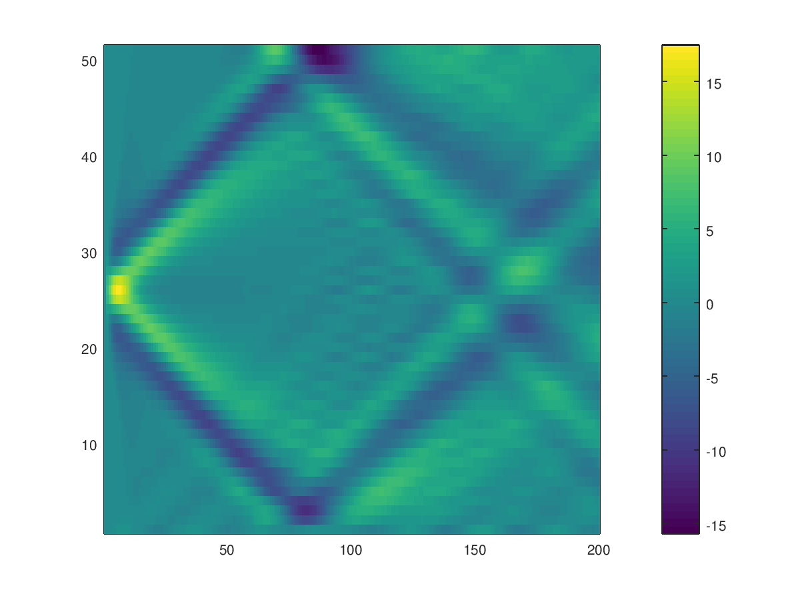

# README

This repository contains a small example that demonstrates how use the *hydrofrac* module in
[FDMAP](https://bitbucket.org/ericmdunham/fdmap/src/master/).
The hydrofrac module couples a nominally planar fluid-filled crack to a surrounding elastic solid.

## Install FDMAP
To run this example, you need to obtain the source code for FDMAP, available [here](https://bitbucket.org/ericmdunham/fdmap/src/master/).
To learn more about FDMAP, see the [user
guide](https://pangea.stanford.edu/~edunham/codes/fdmap/UserGuide-v1.0.pdf). As stated in the user
guide, you need a Fortran compiler, MPI, and suitable implementation of the BLAS and LAPACK
libraries installed. 


### Docker image (optional)
To simplify the installation, this repository contains a [Docker file](Dockerfile) that you
can use to run FDMAP inside a docker container. To build the docker image, clone this repository and
type
```bash
$ docker build .
```
If all goes well, all of the necessary dependencies should be installed and fdmap should be
compiled. The final step of the build process also runs a simulation. 
You can find the compiled version of FDMAP inside the directory `fdmap` within the docker
container, as well as simulation data in `simulation`. To view any of the data, you can interact with the newly created docker image by first looking up its
name
```bash
$ docker images
```
Copy the IMAGE ID e.g., `1a118489e5e4` and run
```bash
$ docker run -it docker run -it 1a118489e5e4 /bin/bash
Run the simulation using the provided example input file (see below),

```bash
$ root@4061eb40b079:/# cd simulation && ./fdmap hydrofrac.in
```
List generated simulation data:
```
$ root@4061eb40b079:/# ls simulation
curves          hydrofrac.m          hydrofrac_B_sxy.t    hydrofrac_B_vx.t    hydrofrac_B_x.t    hydrofrac_I_p.t    hydrofrac_I_v.t     hydrofrac_I_wp.t   hydrofrac_I_y.t
fdmap           hydrofrac_B_sxx.dat  hydrofrac_B_syy.dat  hydrofrac_B_vy.dat  hydrofrac_B_y.dat  hydrofrac_I_u.dat  hydrofrac_I_wm.dat  hydrofrac_I_x.dat  hydrofrac_demo.in
hydrofrac.ckpt  hydrofrac_B_sxx.t    hydrofrac_B_syy.t    hydrofrac_B_vy.t    hydrofrac_B_y.t    hydrofrac_I_u.t    hydrofrac_I_wm.t    hydrofrac_I_x.t    
hydrofrac.in    hydrofrac_B_sxy.dat  hydrofrac_B_vx.dat   hydrofrac_B_x.dat   hydrofrac_I_p.dat  hydrofrac_I_v.dat  hydrofrac_I_wp.dat  hydrofrac_I_y.dat
```

To copy simulation data from the container to the host, you need the CONTAINER ID. Here's how to get
the last used container ID.
```bash
$ docker ps -alq
$ abf4605d89e7
```
Then you can copy the simulation directory from the container to the host via
```bash
 $ mkdir -p simulation
 $ docker cp abf4605d89e7:/simulation simulation
```

## Input file
The fluid-filled crack acts as an interface between two elastic blocks, and it has a few options
that you can configure. 
```
&hydrofrac_list
coupled = T,
! Use a linear model in the width-averaged approximation. 
linearized_walls = T,
! Use implicit-explicit time stepping to prevent prohibitely expensive small time steps (first order
in time accuracy)
operator_splitting = T,
! Enable fluid viscocity
inviscid = F,
! Numerical method to use 
FDmethod = 'SBP6',
! Number of grid points inside the fracture (along the width direction)
n = 40,
! Nominal wall opening 
w0 = 1.000000d-03,
! Fluid density
rho0 = 1.000000d+00,
! Fluid bulk modulus
K0 = 2.250000d+06,
! Fluid dynamic viscosity
mu = 1.000000d-06,
! Put a source term inside the crack at (0,0)
source_term = T,
xsource = 0.000000d+00,
ysource = 0.000000d+00,
Asource = 1.000000d+06,
wsource = 8.000000d-01,
tsource = 1.000000d-03,
! Apply left pressure boundary condition with sine-wave boundary data
! see hydrofrac.f90 for details
bcL = 'sin_p', 
bcLomega = 6.283185d+02,
bcRA = 1.000000d-02,
bcRomega = 6.283185d+02,
! Store LU factorization of diffusion operator as a banded matrix 
banded_storage = T
```
More details regarding the hydrofrac options are documented in the source code itself, see
`fdmap/hydrofrac.f90`.

### Crack profiles and variable grid stretching along the width direction
The input file above configures a tabular crack with uniform grid spacing across the width of the
crack. If you need to use a tapered profile and/or need to resolve boundary layers, you need to
generate some data files and link to them in the input file. For example, add the following to the
input file:
```
geom_file = 'profile.curve',
var_file = 'grid_stretching.var',
```
You can use the matlab functions found in `matlab/write_hf_profile.m` and `matlab/write_hf_var.m` to generate
these files.

## Postprocessing
The script, `postprocess.m`,  loads the simulation data and generates a space time plot of
the pressure field inside the crack. For this script to work, it needs to find the fdmap matlab
files. If you put the `fdmap` directory next to the script, it should work.
Otherwise, you need to modify the script `postprocess.m` accordingly.

Here is the expected output from running the postprocessing script.


The pressure field is is intentionally poorly resolved so that the simulation runs fast on a single
CPU core. 
